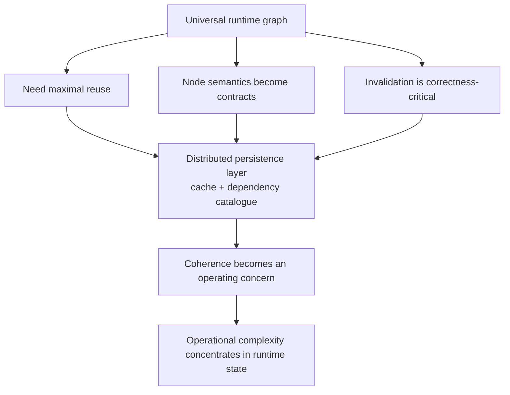
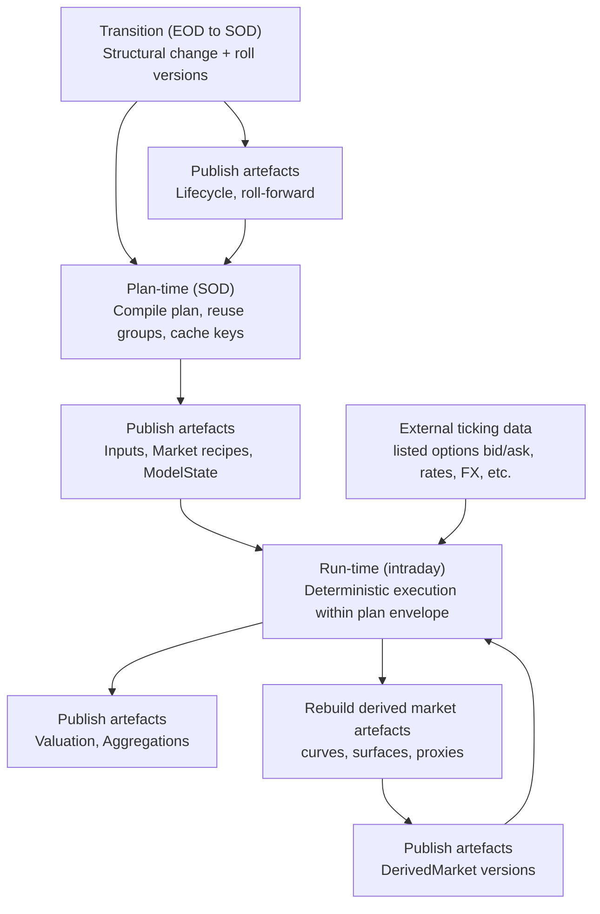

# Determinism Scales Better Than Discovery

**Thesis:** When dependencies are knowable (as they often are in pricing and risk), explicit orchestration plus explicit caching scales better than runtime discovery plus database-as-memoisation *(i.e., when the persistence layer quietly becomes the cache and dependency catalogue).*

This is not an argument against graphs. It is an argument about **where you pay complexity**.

* **Universal runtime dependency substrate:** node semantics + invalidation + distributed coherence become the “product”.
* **Compiled plans + explicit artefacts:** versioned artefacts, explicit reuse boundaries, and rule-driven invalidation inside a known plan envelope.

Some of the most successful analytics platforms in finance are graph-centric. They deliver reuse, incrementality, and lineage, often extremely well, under the constraints they were optimised for. The problem starts when the graph becomes a **universal runtime substrate** that tries to unify market construction, calibration, valuation, lifecycle, aggregation, reporting, and sometimes operations under a single dependency model.

At that point, scaling pressure shifts from analytics to graph mechanics: granularity politics, invalidation correctness, cache coherence, propagation, distributed coordination, and the operational burden of keeping the whole system intelligible.

For a large class of production workloads, you can do something simpler: **compile the plan** *(pre-declare dependency structure, reuse groups, and cache keys for a stability window)*, **execute deterministically**, and apply **deltas** at clean transition points — while retaining incrementality, reuse, auditability, and throughput.

## 1) Why “flexibility” keeps showing up in a static world

Many platform invariants are durable: reproducibility, lineage, controlled change, and predictable cadence (daily risk cycles and end-of-day controls). These constraints do not make the domain simple. They reduce degrees of freedom and reward designs that make state, change, and recomputation explicit.

Despite this, teams often default to “design for flexibility” early. Sometimes it is genuinely required. More often, it is a hedge against the inability (or unwillingness) to close definitions early. “Flexibility” becomes the safe answer when scope and semantics are not aligned, ownership is unclear, or downstream constraints are known but not yet made explicit.

The architecture smell is not flexibility itself. It is **flexibility-as-ambiguity**: pushing closure into runtime so disagreements are postponed rather than resolved. You see it when configuration becomes a programming language, behaviour depends on runtime wiring rather than explicit pipelines, and “resolution” logic expands until it becomes the system.

Once runtime resolution becomes the norm, a universal dependency graph becomes an attractive narrative: express everything as dependencies and let the system discover what to run.

## 2) Universal runtime graphs: where complexity moves

In a graph-centric platform, you represent derived values as a dependency graph. Execution resolves nodes, follows edges, and computes what is needed. Caching often lives inside node resolution to avoid recomputation. This can be highly effective in interactive settings: change an input and observe downstream effects quickly; reuse is local; lineage falls out naturally.

In practice, the split is often between:

- **Interactive workflows** (humans iterating on a small slice of state), and
- **Production runs** (batch risk, scenario packs, reporting cuts) where reproducibility and throughput dominate.

When a universal runtime graph becomes the platform substrate, complexity tends to climb a predictable ladder:

1. **Node semantics become contract**
   Node granularity is no longer an internal detail; it becomes your platform API.
2. **Invalidation becomes correctness-critical**
   If a dependency edge is wrong, you silently produce incorrect numbers or silently rerun too much.
3. **Distributed graph ⇒ coherence becomes product**
   Caching, persistence and synchronisation stop being implementation details and become part of the operating model.

The universal graph trap is not “graphs”. It is **imposing one set of node semantics across heterogeneous domains** (pricing, calibration, aggregation, reporting, and beyond). What is a clean node boundary for one domain can be pathological for another.

The granularity debate rarely ends because it is not purely technical. It becomes a proxy for semantic ownership: different groups want different decomposition, and you cannot satisfy all domains with one canonical node model.

At scale, universal runtime graphs need fast reuse. You cannot recompute everything. So the system externalises memory. A distributed persistence layer stores partial results and becomes the practical cache. It also becomes part of provenance, because you need a catalogue of “what exists” and “what depends on what”.

When caching is embedded inside node evaluation, reuse becomes an emergent property of runtime behaviour. Invalidation is intertwined with dependency resolution. Performance depends on cache warmness and coherence timing. Reproducing a result can require reconstructing runtime state and invalidation pathways. Operationally, you end up debugging dependency state, not replaying explicit versions.

## 3) The inversion: compiled plans plus explicit artefacts

Once caching and invalidation become substrate concerns, the platform pays a permanent coherence tax. In pricing and risk, where reproducibility and controlled change dominate, it is often cleaner to invert the model: make intermediate states first-class artefacts, and make recomputation an explicit policy.

In a scheduling-centric platform, you treat the system as workflows that publish and consume **versioned artefacts**. Execution is orchestrated deterministically. Caching is a deliberate policy at artefact boundaries. Invalidation is rule-driven by artefact type and version.

A minimal artefact interface that scales is something like:

- `Inputs_v…` (normalised observations, mappings, quality filters)
- `MarketArtefacts_v…` (curves, surfaces, proxies, derived market states)
- `ModelState_v…` (calibration outputs and parameters)
- `ValuationResults_v…` (prices, PV explain, per-trade outputs)
- `Aggregations_v…` (portfolio views, measures, reporting cuts)

**Key constraint:** the financial entities themselves remain architecture-free: market items, products, models, measures, etc. are **fully immutable objects** with no embedded “validation status” or infrastructure metadata. Any environment- and run-specific concerns (quality gates, attestation, sign-off, “validated for desk X”) belong to **the Market (or a higher-level construct)** that owns those operational semantics, without contaminating the domain objects.

The benefit is not abstract “domain containment”. It is that complexity concentrates in **orchestration, plan compilation, and artefact contracts**, rather than being embedded in universal runtime semantics. That keeps the financial layer simpler: quants and strats can add instruments/models and debug behaviour by inspecting published inputs and outputs, without reasoning about global graph state.

### A concrete example: option selection policy for surface fitting

A rule change in listed option selection is common and governance-driven: eligibility, filtering, weighting, trimming. You might tighten the moneyness band, introduce a minimum open interest threshold, exclude certain expiries, or adjust outlier handling.

In an artefact-based system:

- selection/fitting policy is a versioned artefact (e.g., `FitPolicy_vK`)
- the surface is a derived artefact (e.g., `Surface_vK`)
- publish `FitPolicy_vK+1` and regenerate `Surface_vK+1`

Invalidation is explicit and bounded: downstream consumers rerun; unrelated domains do not. Before/after analysis is trivial: pin versions and replay deterministically.

In a discovery-driven universal graph, eligibility rules often live inside resolution paths. Dependencies become conditional, invalidation can expand beyond what you intended, and reproducing “before vs after” can require reconstructing runtime graph state rather than selecting artefact versions.

### The pragmatic hybrid

Graphs are extremely useful inside bounded domains. Use them where the dependency set is genuinely fluid and local (research, interactive slicing, “what if…” iteration). The point is: **don’t make a universal runtime graph the substrate for the whole production platform** if your main workloads live in stable-plan, repeated-run regimes.

## 4) Time-axis architecture: compile, execute, transition

The missing dimension in most debates is time. In many production environments, work occurs inside stability windows.

The start-of-day set of positions and books is well defined. Overnight model recipes are fixed. Intraday overrides (if any) are bounded. Market input families are predictable. You can often precompile what will be computed — not the results.

This leads to a simple rhythm:

- **Plan-time (SOD):** compile execution plans for the stability window, including reuse groups, cache keys, and an allowed recipe envelope.
- **Run-time (intraday):** execute deterministically and apply deltas as explicit transitions that produce new artefacts (new trades, bounded overrides, market refresh triggering rule-driven invalidation).
- **Transition (EOD → SOD):** apply lifecycle and corporate actions, roll positions, refresh plans locally and incrementally. This is where structural change belongs.

This approach is not anti-incremental. It is incremental at a granularity that is predictable and auditable.

A useful place to apply dependency thinking is risk measures. Treat measure production as a **precompiled plan artefact**. Inputs include portfolio decomposition, requested measures, shock taxonomy, recipe envelope, and reuse constraints.

Output is a `MeasurePlan`: a DAG or schedule of steps that builds perturbed-world artefacts (cacheable), runs valuation (standard pricing logic), and performs differentiation with annotated reuse groups, cache keys, and explicit parallelisation. Because the plan is precomputed, sequencing is simple, parallelism is explicit, reuse is deliberate, and you do not need a universal runtime graph substrate to achieve incrementality.

The same regime is stronger beyond pricing/risk. MO/BO is also a world of **stable run definitions**, **explicit event boundaries**, and **audit-first replay**: trades/events in, versioned reference/market snapshots, deterministic enrichment, and reconciled outputs. The difference is not the paradigm, but the artefacts (e.g., bookings, confirmations, positions, cash, ledger) and the control gates around them.

## 5) Counterarguments, with the right boundary

Universal graphs can deliver minimal recomputation, especially in interactive settings. But minimal recomputation is not free. It requires dependency bookkeeping and invalidation correctness, and as heterogeneity and layering increase, those costs can dominate.

It’s also true that some organisations run universal graph substrates successfully in production — typically by **standardising semantics aggressively**, constraining degrees of freedom, and accepting the coherence tax as the price of uniformity.

Lineage and auditability do not require universal node semantics. They can be captured by artefact versioning plus execution provenance.

The point is not to deny that universal graphs can be the right tool. It is to highlight that many production pricing and risk workloads live in a different regime: stable plans, repeated runs, bounded deltas, and clean transition points.

As a rule of thumb:

- **Graphs win** when dependency sets are unknown, structural mutation is frequent, and humans are steering exploration.
- **Compiled plans + artefacts win** when the run definition is knowable, repeated, and operationally governed.

## 6) Diagnostic checklist and closing principle

If you are unsure which regime you are in, ask questions you can audit from metadata and run logs:

1. **What is your unit of change, and what is the blast radius?**
   If a fitting policy changes, can you produce the **rerun set** (the list of artefacts to regenerate) *without executing anything*?

2. **Can you reproduce any number from stored inputs?**
   Can you replay by pinning artefact versions and a plan identifier, deterministically, on a clean environment?

3. **Do you have clean transition points?**
   Do structural changes occur at explicit boundaries (EOD → SOD) with local incremental recomputation, or do they leak into intraday runtime discovery?

4. **Is caching explicit or emergent?**
   Can an on-call engineer explain caching and invalidation from artefact metadata and run logs alone, without reading evaluation code paths?

Constraints are not the enemy. In a regulated environment, constraints are often the support that makes the system scalable.

When dependencies are knowable, the scalable choice is to declare them: compile plans, publish artefacts, cache explicitly, invalidate by rules, execute deterministically, and apply deltas at clean transition points.

If the plan can be compiled, the platform should not rediscover it at runtime.

